# Workflow Screen Tutorial

This tutorial walks through the Workflow screen from an empty canvas to a saved workflow with the tagging agent running. It covers the layout of the screen, how to add and connect nodes, every input field on each node (and which ones are required), the Monitoring Instructions panel, and the two finishing actions: **Save Workflow** and **Save & Run Tagging Agent**.

Prefer to watch instead? The same walkthrough is available as a narrated video: [workflow-screen-walkthrough.mp4](../../public/tutorials/workflow-screen-walkthrough.mp4) (about 2½ minutes, 1080p with voice narration).

**Inside the app:** click the graduation-cap **Tutorial** icon in the Workflow screen header. It offers **Tutorial steps**, a guided tour that highlights each part of the screen one step at a time (with Back, Next and Skip tour), and **Watch video**, which opens the narrated video in a popup.

---

## Contents

1. [Opening the Workflow screen](#1-opening-the-workflow-screen)
2. [Screen layout](#2-screen-layout)
3. [How the pipeline works](#3-how-the-pipeline-works)
4. [Adding nodes to the canvas](#4-adding-nodes-to-the-canvas)
5. [Connecting nodes with edges](#5-connecting-nodes-with-edges)
6. [Configuring each node](#6-configuring-each-node)
   - [Data node](#61-data-node)
   - [Analysis node](#62-analysis-node)
   - [Review node](#63-review-node)
   - [Assembly node](#64-assembly-node)
   - [Output node](#65-output-node)
7. [Monitoring Instructions](#7-monitoring-instructions)
8. [Validation: what must be true before you can save](#8-validation-what-must-be-true-before-you-can-save)
9. [Save Workflow](#9-save-workflow)
10. [Save & Run Tagging Agent](#10-save--run-tagging-agent)
11. [The Configure, Review and Output tabs](#11-the-configure-review-and-output-tabs)
12. [Workflow Assistant](#12-workflow-assistant)
13. [Canvas controls and theme](#13-canvas-controls-and-theme)
14. [Quick reference: required fields checklist](#14-quick-reference-required-fields-checklist)
15. [Troubleshooting](#15-troubleshooting)

---

## 1. Opening the Workflow screen

There are three ways to reach the Workflow screen:

| From | Action | Where you land |
|---|---|---|
| Projects page | Click **New Project** (top right) or the dashed **Add New Project** card | A brand-new draft workflow at `/new/workflow` |
| Projects page | Open an existing project that has no sessions yet | A draft workflow for that project |
| Project page | Open an existing session's workflow | The saved workflow for that session, ready to edit |

A **draft** workflow has not been saved yet. Nothing exists on the server until you click **Save Workflow** or **Save & Run Tagging Agent**. The project itself is created at that moment, using the name and description you enter on the Output node.

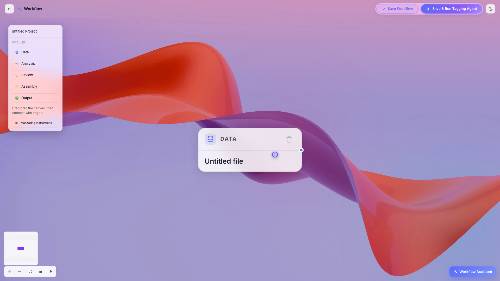

---

## 2. Screen layout

The screen has five regions.

**Header (top).**
- **Back arrow**: returns to the projects list.
- **Project name**: shows the project's name once it exists. On a draft it reads "Workflow".
- **Configure / Review / Output tabs** (centre): appear only after the project has been saved. See [section 11](#11-the-configure-review-and-output-tabs).
- **Save Workflow** and **Save & Run Tagging Agent**: the two finishing actions. Both are disabled while a save or a tagging job is in progress.
- **Tutorial** (graduation-cap icon): opens a menu with the guided tour and the walkthrough video.
- **Theme toggle** (moon/sun icon): switches between light and dark mode.

**Modules palette (left).**
Five draggable modules: **Data**, **Analysis**, **Review**, **Assembly**, **Output**. Below them is the **Monitoring Instructions** button.

**Canvas (centre).**
The graph editor. Every new workflow starts with one **Data** node already placed. Click a node to select it and open its configuration panel; click empty canvas to deselect. Press Delete or Backspace to remove a selected node or edge, or use the trash icon in the node's header.

**Configuration panel (right).**
Opens when a node is selected. It is where all of a node's settings live. It closes when you click empty canvas.

**Canvas controls and minimap (bottom left).**
Zoom in, zoom out, fit view, lock (toggle interactivity) and **auto-format layout**, plus a minimap you can pan and zoom.

**Workflow Assistant (bottom right).**
An AI copilot that can generate or rewrite the whole graph from a text prompt. See [section 12](#12-workflow-assistant).

---

## 3. How the pipeline works

A workflow is a left-to-right pipeline with five stages, always in this order:

```
Data  →  Analysis  →  Review  →  Assembly  →  Output
```

| Stage | What it does |
|---|---|
| **Data** | Where the articles come from: an uploaded CSV/Excel file or a live REST API pull from your connected news providers. Also holds the brand keyword and message keywords. |
| **Analysis** | Runs one *Intelligence Lens* (a type of analysis) over the articles with a chosen LLM, measuring your brand against competitor keywords. You can have several Analysis nodes, each with a different lens. |
| **Review** | The analyst checkpoint. Confidence thresholds decide which tagged articles are flagged for human review and which are auto-approved. |
| **Assembly** | The Dashboard Builder. Chooses the client name shown on the dashboard, the layout template, and which charts to include. |
| **Output** | Publishes the result as a dashboard and carries the project name and description. |

A valid workflow needs **at least one node of every type** and **a complete connected path from a Data node to an Output node**. Edges may only link a node to the *next* stage. Skipping a stage, going backwards, or linking two nodes of the same stage is invalid and the edge turns red.

---

## 4. Adding nodes to the canvas

Nodes are added by **drag and drop**. There is no click-to-add.

1. Press and hold on a module in the left palette (for example **Analysis**).
2. Drag it over the canvas.
3. Release to drop it.

When you drop a node, three things happen:

- The node is placed where you released it.
- **If the most recently added node is the previous stage, the new node is connected to it automatically.** Dropping Analysis after Data, Review after Analysis, and so on, gives you the edge for free.
- The canvas zooms to the new node and its configuration panel opens on the right.

Tips:

- You can add more than one Analysis node to run several lenses. Only the first one auto-connects (see [section 5](#5-connecting-nodes-with-edges) for wiring the rest).
- Competitor keywords and the LLM choice are copied from an existing Analysis node when you drop another one, so you only type them once.
- Dropping an Output node pre-fills the project name and description if the project already exists.
- After adding several nodes, click **Auto format layout** (bottom left) to arrange everything into tidy columns and fit the whole graph on screen.

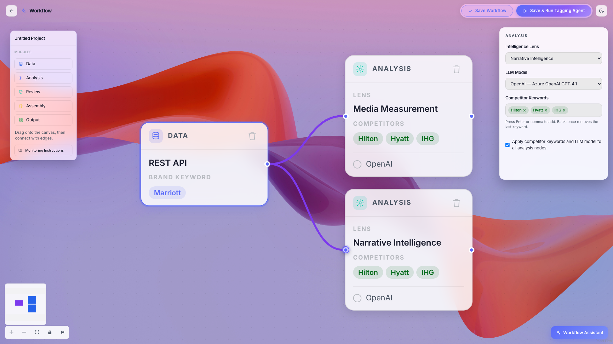

---

## 5. Connecting nodes with edges

Every node has small circular **handles**: an input handle on its left edge and an output handle on its right edge (the Data node has only an output; the Output node has only an input).

To draw an edge:

1. Move the mouse over the **right-hand handle** of the source node.
2. Press and drag toward the **left-hand handle** of the target node.
3. Release on the target handle.

Rules:

- Valid edges go **Data → Analysis → Review → Assembly → Output** only.
- An invalid edge is still drawn but shown in **red** with a warning message. Saving is blocked until it is removed (select it and press Delete).
- A Review node that receives a **Media Monitoring** analysis cannot receive any other analysis. Give Media Monitoring its own Review node.
- Several Analysis nodes may feed the same Review node (as long as none of them is Media Monitoring).
- When you add or remove nodes, all existing edges are re-checked and recoloured automatically.

---

## 6. Configuring each node

Click a node to open its panel. Changes apply immediately to the node card on the canvas, so you can see the configuration at a glance.

### 6.1 Data node

The Data node is created for you. It defines where articles come from and what the project is tracking.

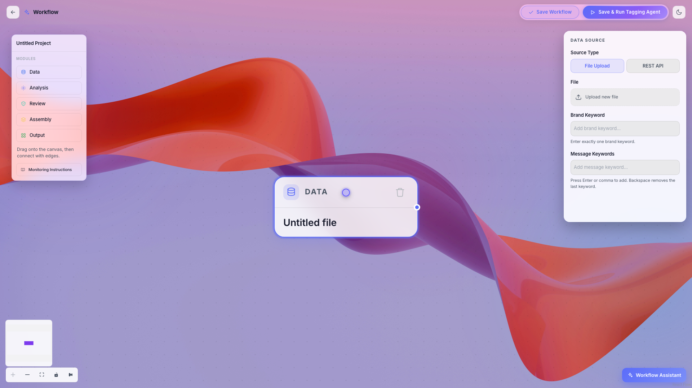

| Field | Required | Description |
|---|---|---|
| **Source Type** | Yes (one of the two) | **File Upload** for a CSV, XLSX, XLS or JSON export of articles, or **REST API** to pull articles live from your organisation's data providers. REST API is disabled while a file is attached; remove the file to switch. File Upload is disabled once a session has been created as an API session. |
| **File** (File Upload mode) | Yes, if using File Upload | Click **Upload new file** and choose a `.csv`, `.xlsx`, `.xls` or `.json` file. If the project already exists you can also pick a previously uploaded file from the dropdown. The file is uploaded when the workflow is saved. |
| **Data Providers** (REST API mode) | Yes, at least one | Multi-select list of the news providers active for your organisation. Google News is selected by default. |
| **Query** (REST API mode) | Yes, when a provider is selected (unless a brand keyword is set) | Boolean search sent to the providers. Supports `AND`, `OR`, `NOT`, parentheses and single or double quotes, e.g. `('Marriott' OR 'Marriott Bonvoy') AND NOT 'Marriott Vacations'`. Operators are upper-cased for you. Unbalanced parentheses are flagged as an error. |
| **Brand Keyword** | Yes, **exactly one** | The brand this project is about. Type it and press Enter or comma. Once one keyword exists the input hides; remove the chip to change it. |
| **Message Keywords** | Yes, **at least one** | Themes to track inside the coverage (for example *Loyalty*, *Sustainability*, *Expansion*). Press Enter or comma after each. Backspace on an empty field removes the last chip. |

Cross-field rule: you must have **either** a file **or** at least one data provider. If neither is present the Source Type field shows "Either File Upload or an Active Data Provider is required."

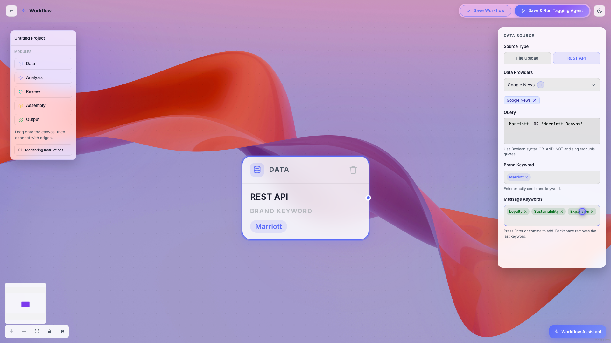

### 6.2 Analysis node

Each Analysis node runs one lens. Add one node per lens you want.

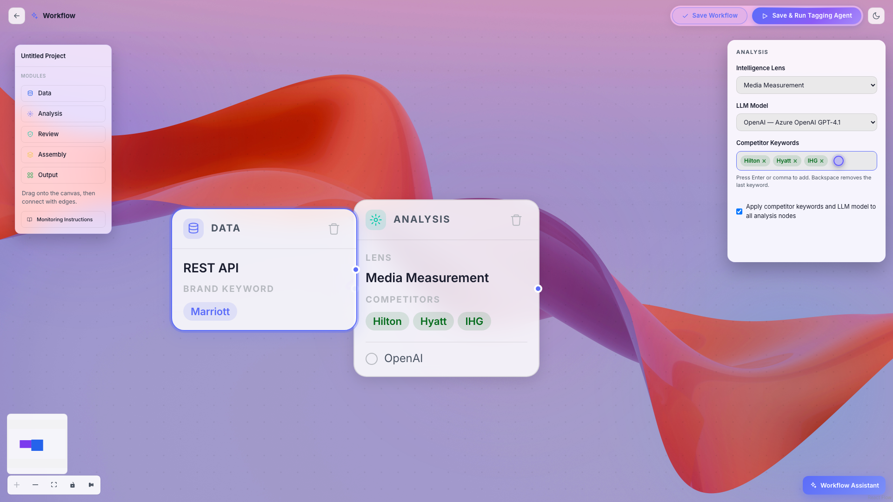

| Field | Required | Description |
|---|---|---|
| **Intelligence Lens** | Yes | One of **Media Measurement**, **Media Monitoring**, **Narrative Intelligence**, **PR Impact**, **Reputation Index**. A lens already used by another Analysis node is greyed out with the note "(Already selected in another node)". Each lens may be used **once** per workflow. |
| **LLM Model** | Yes | The language model that performs the tagging: **OpenAI** (Azure OpenAI GPT-4.1), **Claude** (Opus 4.8) or **Gemini** (Gemini 2.5 Pro). |
| **Competitor Keywords** | Yes, at least one | The brands you measure against (for example *Hilton*, *Hyatt*, *IHG*). Press Enter or comma after each. |
| **Apply competitor keywords and LLM model to all analysis nodes** | No (on by default) | When ticked, the competitors and model you set here are shared with every other Analysis node, so you only maintain them once. |

### 6.3 Review node

The Review node has no required fields. It controls how much of the tagged output a human looks at.

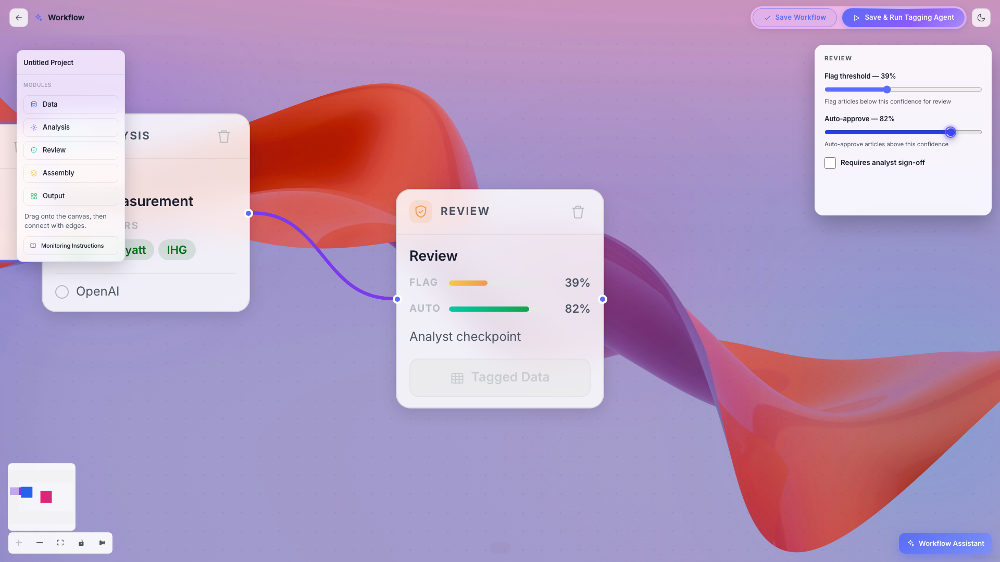

| Field | Required | Default | Description |
|---|---|---|---|
| **Flag threshold** | No | 50 % | Articles whose tagging confidence is **below** this value are flagged for analyst review. |
| **Auto-approve** | No | 75 % | Articles whose confidence is **above** this value are approved automatically. |
| **Requires analyst sign-off** | No | Off | When ticked, a badge appears on the node and a person must approve results before the dashboard is built. |

The node card shows both thresholds as bars and a **Tagged Data** button. That button is disabled until the session has been tagged; afterwards it opens the Review page.

### 6.4 Assembly node

The Assembly node ("Dashboard Builder") has two tabs in its panel: **Layout & Client** and **Dashboard Charts**.

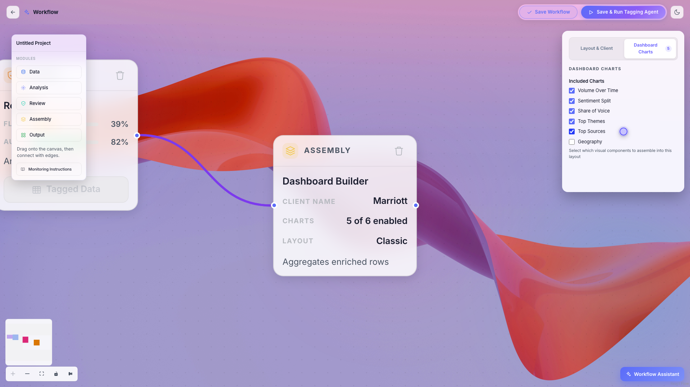

| Tab | Field | Required | Default | Description |
|---|---|---|---|---|
| Layout & Client | **Client Name** | **Yes** | empty | The client name displayed on the dashboard. |
| Layout & Client | **Dashboard Layout** | No | Sense | The visual template: **Sense**, **Classic**, **Editorial**, **Merger**, **PR Impact**, **Glass**, **Bento**. Use the dropdown or click a preview card. Hover a card to play a short video preview. |
| Dashboard Charts | **Included Charts** | No | Volume Over Time, Sentiment Split, Share of Voice, Top Themes | Tick any of the six charts: **Volume Over Time**, **Sentiment Split**, **Share of Voice**, **Top Themes**, **Top Sources**, **Geography**. The tab badge shows how many are enabled. |

### 6.5 Output node

The Output node publishes the dashboard and carries the project's identity.

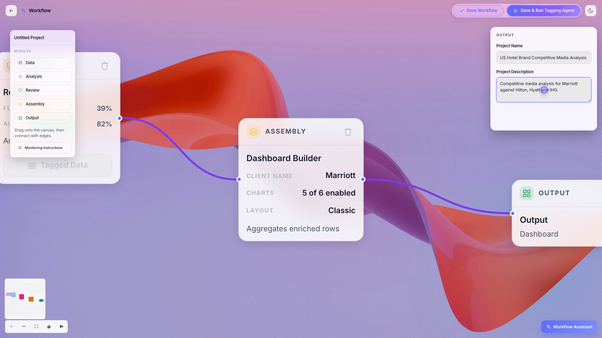

| Field | Required | Description |
|---|---|---|
| **Project Name** | **Yes** | Up to 50 characters. On a draft, saving **creates the project with this name**. On an existing project, changing it renames the project. |
| **Project Description** | **Yes** | What the project is about. Saved to the project alongside the name. |

There is no separate "workflow name" field anywhere on the screen: the project name entered here is the name shown in the header and in the projects list after saving.

---

## 7. Monitoring Instructions

The **Monitoring Instructions** button sits below the palette. It opens a notes panel where you can give the tagging agent free-text guidance for the *Media Monitoring* sections, for example which topics to prioritise or how to group coverage.

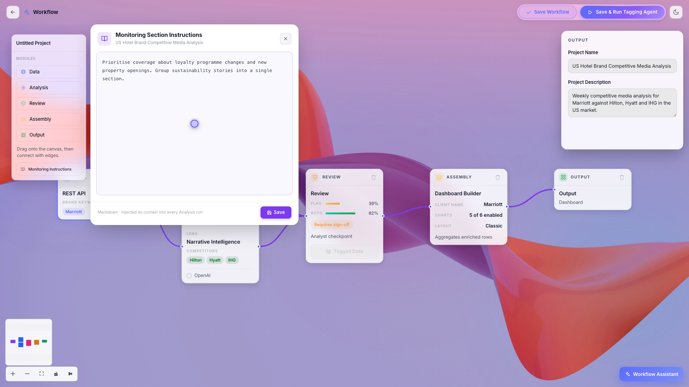

1. Click **Monitoring Instructions**.
2. Type your guidance in the text area.
3. Click **Save** in the panel. The button briefly shows "Saved" and the panel closes.

The text is stored on the project the next time you **Save Workflow** or **Save & Run Tagging Agent**. Editing the instructions marks the workflow as having unsaved changes.

---

## 8. Validation: what must be true before you can save

Both finishing buttons run the same checks, in this order. The first failure stops the save and explains itself.

1. **Data source confirmation.** If the Data node is in File Upload mode but no file is attached, a dialog titled **Data Source Confirmation** asks whether you want to **Upload a File** or **Proceed with REST API**. Choosing REST API switches the node and continues.

   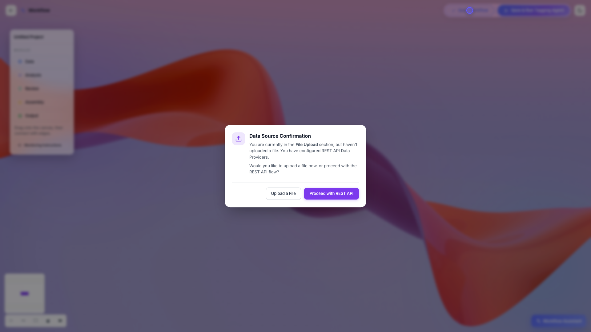

2. **Per-node required fields and connections.** Every node with a problem is outlined in red and lists its issues directly on the card (for example "Exactly one brand keyword is required", "Data node must connect to an Analysis node"). A toast reads "Please fix the highlighted issues and connect all nodes before saving."

   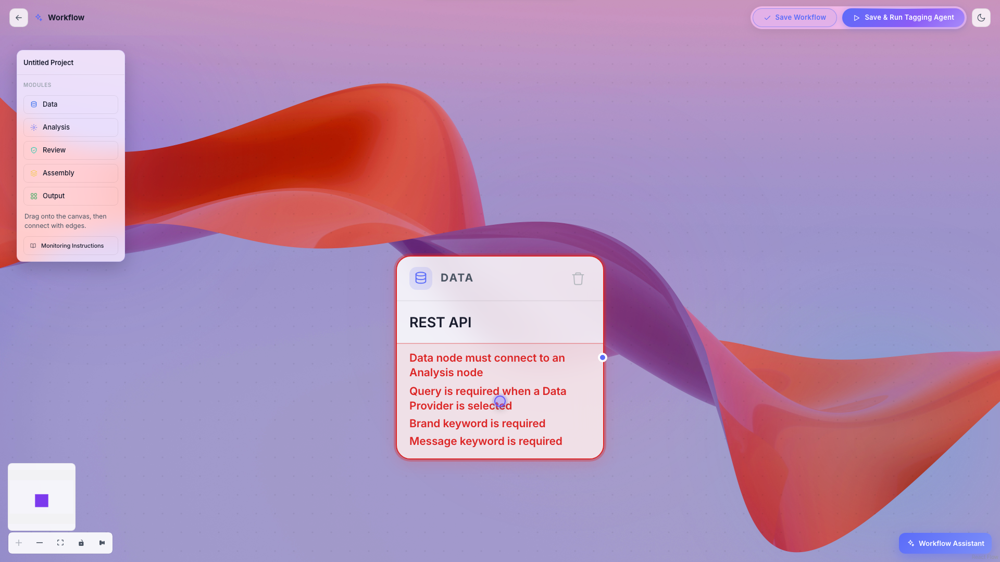

3. **All five node types present.** Missing one produces "Please add a Data / Analysis / Review / Assembly / Output node to the workflow."
4. **No invalid (red) edges.** "Nodes must connect in order: Data → Analysis → Review → Assembly → Output."
5. **A complete path from Data to Output.** "The workflow must have a complete connected path from Data node to Output node."
6. **Field content checks**: data source present, query present when a provider is selected, exactly one brand keyword, at least one message keyword, every Analysis node has a lens and at least one competitor keyword, lenses are unique, Client Name set, Project Name and Description set.

Validation errors only appear after your first save attempt, so a fresh canvas looks clean until you click Save.

---

## 9. Save Workflow

**Save Workflow** persists the graph without starting any processing. Use it to save progress or to hand the configuration to a colleague.

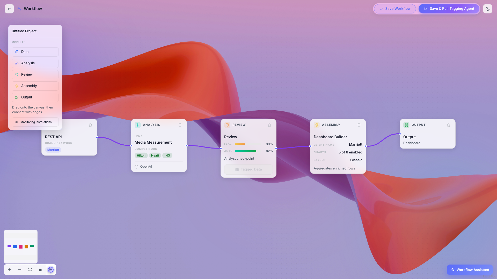

What happens when you click it:

1. The validation checks in [section 8](#8-validation-what-must-be-true-before-you-can-save) run.
2. On a **draft**, the project is created from the Output node's name and description, then a session is created for it. If a file is attached to the Data node, it is uploaded first.
3. The workflow graph (nodes, positions, settings and edges) is saved on the session.
4. If the project name or description changed, the project is updated. Monitoring Instructions are saved if they changed.
5. A toast confirms **"Workflow saved."** The URL changes from `/new/workflow` to `/<projectId>/sessions/<sessionId>/workflow`, the header shows the project name, and the **Configure / Review / Output** tabs appear.

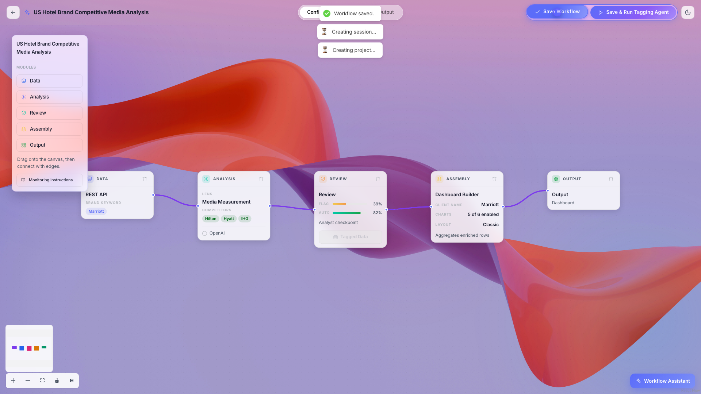

Saving again on an existing session simply overwrites the stored graph.

---

## 10. Save & Run Tagging Agent

**Save & Run Tagging Agent** does everything Save Workflow does, then starts processing.

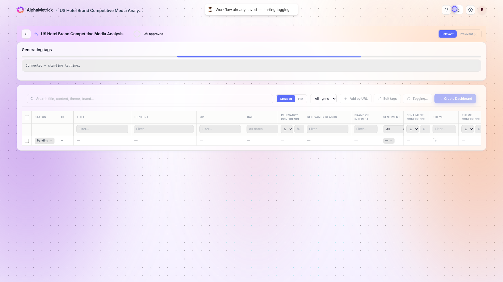

1. The same validation runs.
2. If there are unsaved changes (or no session yet), the workflow is saved exactly as in [section 9](#9-save-workflow) and you see **"Workflow saved — starting tagging..."**. If nothing changed, you see **"Workflow already saved — starting tagging..."** and no save request is made.
3. You are taken to the **Review page** for the session, which opens a live connection to the tagging agent and shows its progress.
4. The tagging agent reads every article, applies each Analysis node's lens with the chosen LLM, uses the brand, competitor and message keywords, and produces the tagged data. When it finishes, the Review node's **Tagged Data** button becomes active and the dashboard can be built from the **Output** tab.

You cannot navigate to the Review or Output tabs while a save or tagging job is running; a toast asks you to wait.

---

## 11. The Configure, Review and Output tabs

The tab bar in the header appears once the project exists (after the first save).

| Tab | Opens | Prerequisite |
|---|---|---|
| **Configure** | This canvas. | Always available. |
| **Review** | The table of tagged articles for the session, with the analyst review tools. | Workflow must pass validation and have **no unsaved changes**. Otherwise: "Please save the agent for the new changes that are applied before proceeding." |
| **Output** | The generated dashboards for the session. | Same as Review. |

---

## 12. Workflow Assistant

The **Workflow Assistant** button (bottom right of the canvas) opens a chat dock. Describe the workflow you want in plain English, for example:

> Build a workflow for Marriott against Hilton, Hyatt and IHG using Media Measurement and Narrative Intelligence with OpenAI, Classic layout.

- Three sample prompts are offered when the thread is empty; clicking one appends it to the input.
- Quick-select chips for **Lens**, **LLM** and **Layout** add "Field: Value" fragments to your prompt.
- The paperclip attaches a single CSV or Excel file to use as the data source.
- Press Enter to send (Shift+Enter for a new line).

The assistant **replaces the whole canvas** with the generated graph, auto-formats it and shows "Workflow generated from your prompt." If it needs more information it asks a clarifying question instead. Review the result, adjust anything in the panels, and save as usual.

---

## 13. Canvas controls and theme

| Control | Location | What it does |
|---|---|---|
| **+** / **−** | bottom left | Zoom in / out. |
| **Fit view** | bottom left | Fits the whole graph in the viewport. |
| **Lock** | bottom left | Toggles interactivity so nodes cannot be dragged accidentally. |
| **Auto format layout** | bottom left | Arranges nodes into one column per stage and fits the view. |
| **Minimap** | bottom left | Overview of the graph, colour-coded by node type. Pan and zoom by dragging inside it. |
| **Scroll / pinch** | canvas | Zoom. Drag empty canvas to pan. |
| **Delete / Backspace** | keyboard | Removes the selected node or edge. |
| **Moon / Sun** | top right | Toggles light and dark theme (remembered between visits). |

---

## 14. Quick reference: required fields checklist

Use this before clicking Save.

- [ ] **Data**: File attached **or** at least one Data Provider; Query filled (REST API); **exactly one** Brand Keyword; **at least one** Message Keyword.
- [ ] **Analysis** (each): Intelligence Lens chosen and unique; LLM Model chosen; **at least one** Competitor Keyword.
- [ ] **Review**: nothing required (defaults 50 % / 75 %).
- [ ] **Assembly**: Client Name.
- [ ] **Output**: Project Name; Project Description.
- [ ] One node of every type present.
- [ ] Edges only go Data → Analysis → Review → Assembly → Output; no red edges.
- [ ] A continuous path exists from Data to Output.

---

## 15. Troubleshooting

| Symptom | Cause | Fix |
|---|---|---|
| Dropped a module but nothing appeared | The drop landed outside the canvas | Release over the dotted canvas area. |
| New node is not connected | The previously added node was not the previous stage | Drag an edge from the correct node's right handle to the new node's left handle. |
| Edge is red | Nodes connected out of order, or a Media Monitoring analysis shares a Review node | Delete the edge and connect to the correct stage; give Media Monitoring its own Review node. |
| "Please fix the highlighted issues and connect all nodes" | A node has missing fields or connections | Read the red text on each highlighted node and fill in the fields listed. |
| A lens is greyed out | It is already used by another Analysis node | Pick a different lens or change the other node. |
| "REST API" button is disabled | A file is attached to the Data node | Click the trash icon next to the file, then choose REST API. |
| Review or Output tab shows "Please save the agent…" | Unsaved changes on the canvas | Click Save Workflow, then open the tab. |
| Buttons are disabled | A save or tagging job is running | Wait for it to finish. |

---

*Regenerate the video (written to `public/tutorials/`) and these screenshots with `node scripts/tutorial/record-workflow-tutorial.mjs` while the dev server is running (see the header of that script for prerequisites).*
